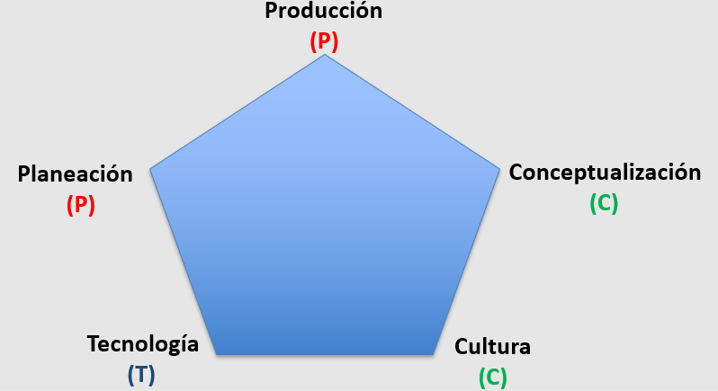
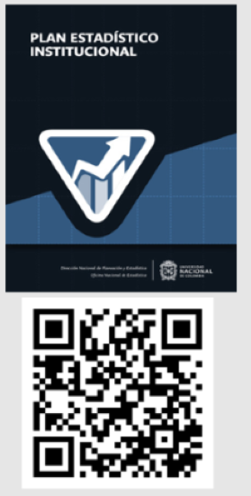
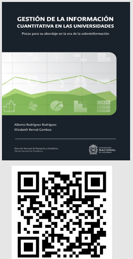
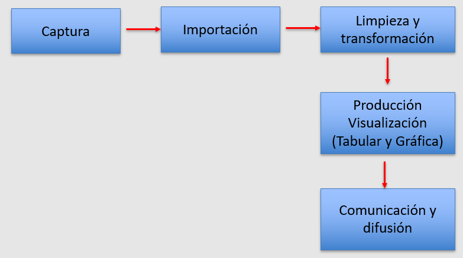
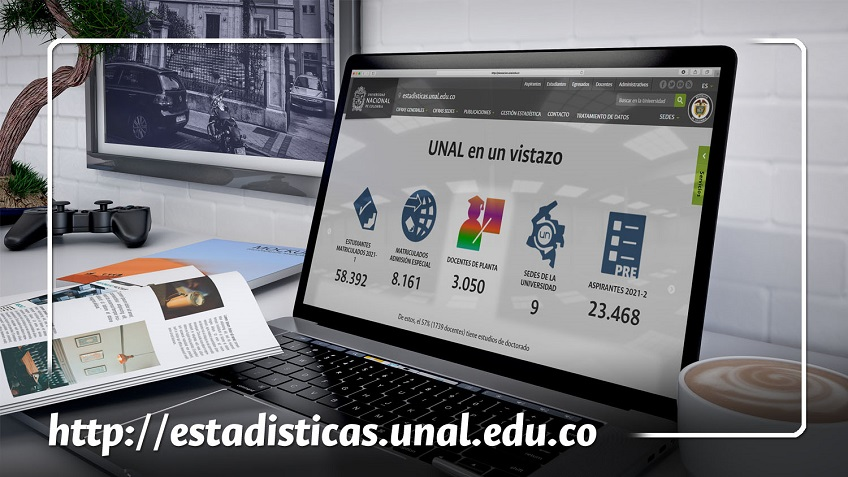
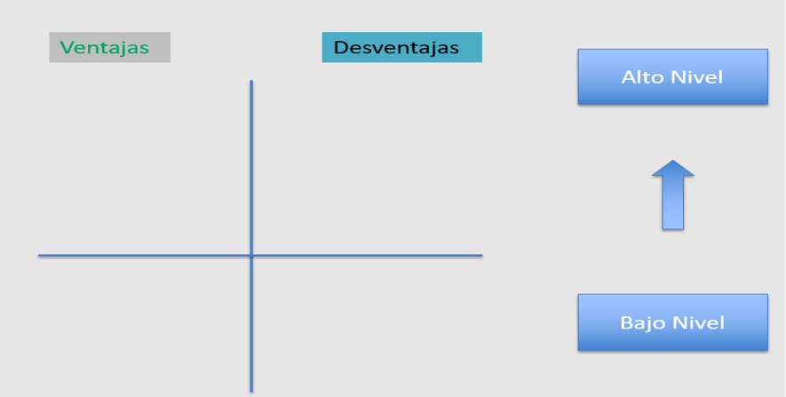
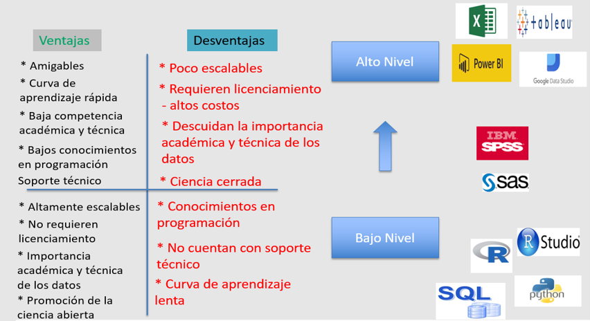
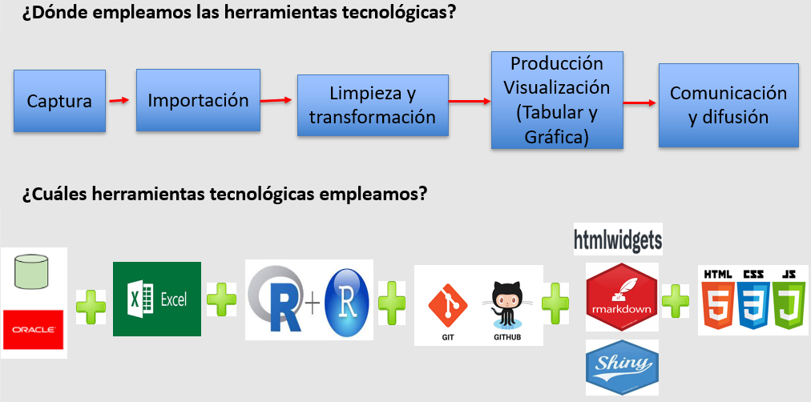
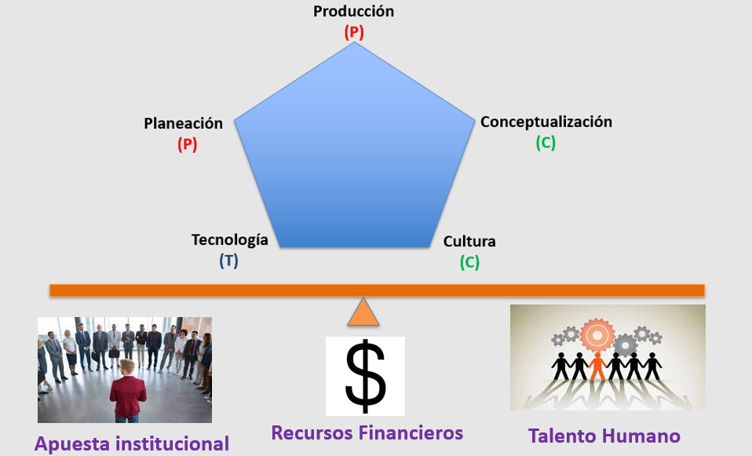

<style>
/* Progress bar */
/* https://github.com/yihui/xaringan/wiki/Progressbar */

.remark-slide-number {
  position: inherit;
}

.remark-slide-number .progress-bar-container {
  position: absolute;
  top: 0;
  height: 6px;
  display: block;
  left: 0;
  right: 0;
}

.remark-slide-number .progress-bar {
  height: 100%;
  background-color: red;
}

</style>

---
class: center, middle
exclude: true

```{r setup, include=FALSE}
options(htmltools.dir.version = FALSE)
knitr::opts_chunk$set(collapse = TRUE,
                      fig.retina = 3,
                      echo = FALSE,
                      fig.align='center')
library(ggplot2)
library(downloadthis)
library(webexercises)
library(countdown)
library(emo)
library(icons)
library(xaringanExtra)
library(fontawesome)
library(gapminder)
library(UnalData)
library(writexl)
library(dplyr)
library(tidyr)
library(readxl)
library(downloadthis)
library(datasauRus)
library(UnalR)
library(janitor)
library(skimr)
library(DataExplorer)
library(summarytools)
library(moments)
library(gridExtra)
library(broom)
library(sjPlot)
library(flipbookr)
xaringanExtra::use_tile_view()
xaringanExtra::use_clipboard()
xaringanExtra::use_webcam()
xaringanExtra::use_search(show_icon = TRUE)
# xaringanExtra::use_share_again()
xaringanExtra::use_fit_screen()
xaringanExtra::use_panelset()
xaringanExtra::use_scribble()
xaringanExtra::use_tachyons()
xaringanExtra::use_extra_styles(hover_code_line = TRUE, mute_unhighlighted_code = TRUE)
xaringanExtra::use_progress_bar(color = "#0051BA", location = "top", height = "10px")
xaringanExtra::use_broadcast()
xaringanExtra::style_search(match_background = "pink")
```

---

class: title-slide, center, middle, hide-count, hide-logo

background-image: url("http://agenciadenoticias.unal.edu.co/fileadmin/Agencia_de_Noticias/Imagenes/2021/06-Junio/097/5.jpg")
background-size: cover

# .big-text.black[ <p style="color:EEEEF2;">Gestión y Producción de Estadísticas Oficiales <br>  Modelo P2C-T</p>
]

<br>
<br>
<br>
<br>
<br>
<br>

.footnote[
.white[Créditos de la Imagen: ][Agencia de Noticias UNAL](http://agenciadenoticias.unal.edu.co/fileadmin/Agencia_de_Noticias/Imagenes/2021/06-Junio/097/5.jpg)
]


---
class: middle, hide-logo

.pull-left[
```{r , echo=FALSE, out.width="65%", fig.align='left'}
 
```

* Alberto Rodríguez Rodríguez
* Asesor - Dirección Nacional de Planeación y Estadística - [DNPE](http://planeacion.unal.edu.co/home/)<br>`r icons::fontawesome$brands$twitter` [@tipsder](https://twitter.com/tipsder)<br>`r icons::fontawesome$brands$github` [estadisticaun](https://github.com/estadisticaun)<br>`r icons::fontawesome$solid$envelope` [albrodriguezr@unal.edu.co](albrodriguezr@unal.edu.co)
<br>`r icons::fontawesome$brands$chrome` [https://albertor.netlify.app/](https://albertor.netlify.app/)
]

.pull-right[
# ¡Algunos datos de interés sobre el expositor!
<br>
<br>
<br>
<br>
# .big-text[Bienvenidos!`r emo::ji("blush")`]

]

---
# .center[Modelo <font color="red">P</font>2<font color="green">C</font>-<font color="blue">T</font>]

La gestión contemporánea de estadísticas oficiales implica tener en cuenta, en nuestro criterio, 5 aristas centrales: **planeación, conceptualización, producción,  tecnología y cultura estadística**. 
<br> 
<br> 

```{r , echo=FALSE, out.width="65%", fig.align='center'}
 
```

---
class: center, middle

# <font color="red">(P)</font><br> Planeación <br> `r emo::ji("teacher")`


---
class: middle, hide-logo

.pull-left[
### Plan Estadístico Institucional - UNAL
```{r , echo=FALSE, out.width="55%", fig.align='center'}
 
```
<font size=2><b>Disponible en: </b><a href="https://estadisticaun.github.io/PlanE/">https://estadisticaun.github.io/PlanE/</a></font>
]
.pull-right[

### Líneas Estratégicas

* **Línea 1**: Lineamientos conceptuales y metodológicos.

* **Línea 2**: Producción estadística.

* **Línea 3**: Gestión de las capacidades técnicas y tecnológicas.

* **Línea 4**: Cultura estadística.
<br>
<br>

### Duración del Plan Estadístico

El [Plan Estadístico](https://estadisticaun.github.io/PlanE/) de la Universidad Nacional de Colombia se espera desarrollar a lo largo de **9 años** (*tres periodos rectorales: PGD 2019-2021 PGD 2022-2024 y PGD 2025-2027*). A la fecha, nos encontramos en el 33% de la implementación de este Plan.

]


---
class: center, middle

# <font color="green">(C)</font><br> Conceptualización <br> `r emo::ji("teacher")`

---
### .center[¿Por qué son importantes los lineamientos conceptuales ? El Universo de lo datos.]


```{r, fig.align='center', out.width='50%', fig.show='hold', echo=FALSE}
knitr::include_graphics('Imagenes/F_15.png')
```

<font size=2><b>Disponible en: </b><a href="https://raw.githubusercontent.com/estadisticaun/L_Conceptual/master/imagenes/F_15.png?token=AHYPBYXH34UNHZARFJBRGH3AXYMUU">Capítulo 3. Gestión de la Información en las Universidades.</a></font>

---
## .center[Escenario Conceptual: estadísticas e indicadores]

```{r, fig.align='center', out.width='88%', fig.show='hold', echo=FALSE}
knitr::include_graphics('Imagenes/Medidas.png')
```
---
class: middle, hide-logo

.pull-left[
### Estadísticas Oficiales
```{r , echo=FALSE, out.width="55%", fig.align='center'}
 
```
<font size=2><b>Disponible en: </b><a href="https://estadisticaun.github.io/L_Conceptual/">https://estadisticaun.github.io/L_Conceptual/</a></font>
]
.pull-right[
### Una primera definición
Las **estadísticas oficiales** son **cifras descriptivas** de interés social e institucional que se caracterizan, en el ámbito de lo público y, dentro de este, en el contexto de las instituciones, principalmente por:

1. Población o muestras
2. Cifras agregadas
3. Desagregaciones (geográficas, temáticas y temporales)
4. Representación tabular y gráfica
5. Comparables
6. Múltiples mecanismos de difusión 
7. Uso intensivo de las TIC 
8. Incluyentes
9.  Ética y legalidad
10. Públicas y transparentes 
11. Metadatos 
12. Proceso Estadístico
13. Fuente construcción de indicadores

]

---
class: center, middle

#<font color="red">(P)</font><br> Producción <br> `r emo::ji("teacher")`

---
## .center[Producción de Estadísticas - Ciclo de Vida del Dato]

```{r , echo=FALSE, out.width="90%", fig.align='center'}
 
```

---
### .center[Comunicación y Difusión de Estadísticas Oficiales en la UNAL - Página de Estadísticas]


```{r , echo=FALSE, out.width="56%", fig.align='center'}
 
```

```{r , echo=FALSE, out.width="18%", fig.align='center'}
 
```
<font size=2><b>Disponible en: </b><a href="http://estadisticas.unal.edu.co/">http://estadisticas.unal.edu.co/</a></font>

---
class: center, middle

# <font color="blue">(T)</font> <br> Tecnología <br> `r emo::ji("teacher")`

---
## .center[Herramientas tecnológicas para la gestión de datos]

```{r , echo=FALSE, out.width="95%", fig.align='center'}
 
```

---
## .center[Herramientas tecnológicas para la gestión de datos]

```{r , echo=FALSE, out.width="88%", fig.align='center'}
 
```

<font size=2><b>Repositorio de Herramientas Para la Gestión de Datos en: </b><a href="https://gallery.keshif.me/VisTools">https://gallery.keshif.me/VisTools</a></font>

---
### .center[Herramientas tecnológicas empleadas por la UNAL en la producción de estadísticas]

```{r , echo=FALSE, out.width="95%", fig.align='center'}
 
```


---
class: center, middle

# <font color="green">(C)</font><br> Cultura Estadística <br> `r emo::ji("teacher")`

---
## .center[Aspectos a tener en cuenta en la cultura estadística]

Uno de los aspectos poco trabajados en la gestión contemporánea de datos, pero de máxima importancia, es el fortalecimiento de la cultura estadística al interior de las instituciones. Aunque no existe una receta para su alcance, consideramos importante adelantar acciones en frentes como:

.pull-left[

### Frentes 

1. Fortalecer, a nivel directivo, el conocimiento de los datos institucionales y la toma de decisiones basadas en estos. 

2. Fortalecer el conocimiento sobre la ubicación y disposición de las cifras oficiales.

3. Fortalecer las competencias numéricas (alfabetización estadística) para entender las cifras institucionales.

4. Fortalecer las competencias académicas y técnicas de los equipos encargados de la producción estadística. 

]

.pull-right[

### Acciones 

* Correos institucionales.

* Campañas en redes sociales.

* Disposición de videos.

* Cursos (virtuales y presenciales).

* Capacitaciones.

* <font color="red"><b>Asistir a conferencias y eventos.</b></font> 

* Distribución de Souvenirs.

* Redes de trabajo colaborativo.
]

---
class: center, middle

# Soportes del Modelo <font color="red">P</font>2<font color="green">C</font>-<font color="blue">T</font> <br> `r emo::ji("teacher")`

---
## .center[Soportes del Modelo <font color="red">P</font>2<font color="green">C</font>-<font color="blue">T</font>]

La disposición de estadística soficiales a nivel institucional exige, como mínimo, el apoyo institucional en tres frentes: ** apuesta institucional, disposición de recursos financieros y talento humano idóneo.**

```{r , echo=FALSE, out.width="75%", fig.align='center'}
 
```

---
class: center, middle

# ¡Muchas Gracias!
